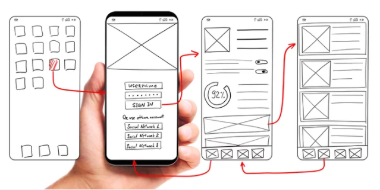

> # HTML  

- HTML (Hypertext Markup Language) is the code that is used to structure a web page and its content.

* HTML should be coded to represent the data that will be populated and not based on its default presentation styling. Presentation (how it should look), is the sole responsibility of CSS.

<<<<<<< HEAD

=======

>>>>>>> 89ecc0b7cf567c7f1feec9a52a9d6a33a16606f3

># Wireframing

Wireframing is a practice used by UX designers which allows them to define and plan the information hierarchy of their design for a website, app, or product. This process focuses on how the designer or client wants the user to process information on a site, based on the user research already performed by the UX design team.